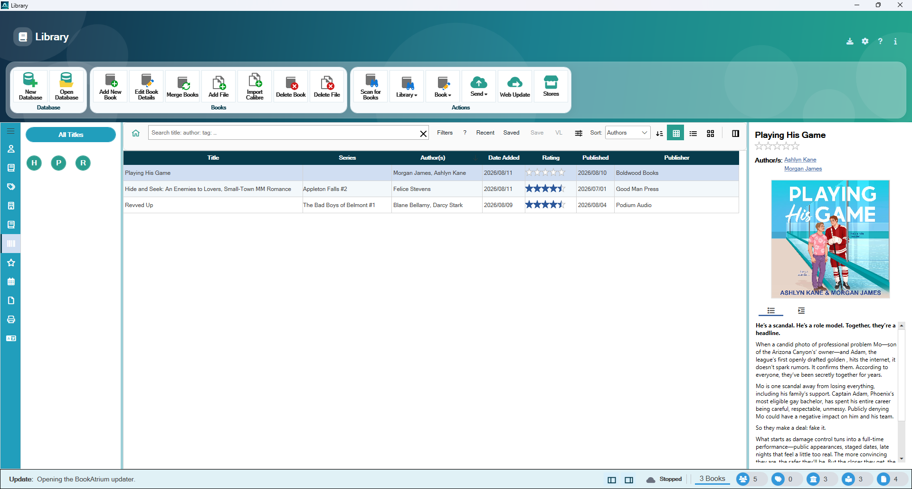
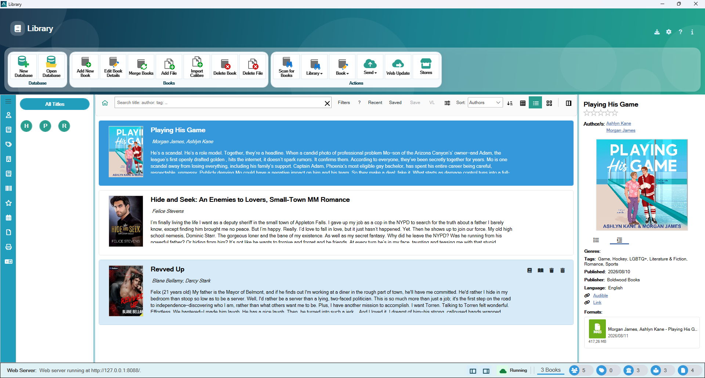
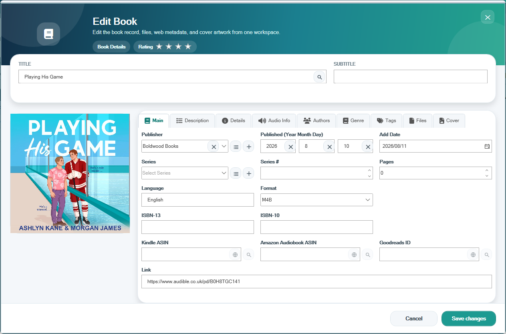
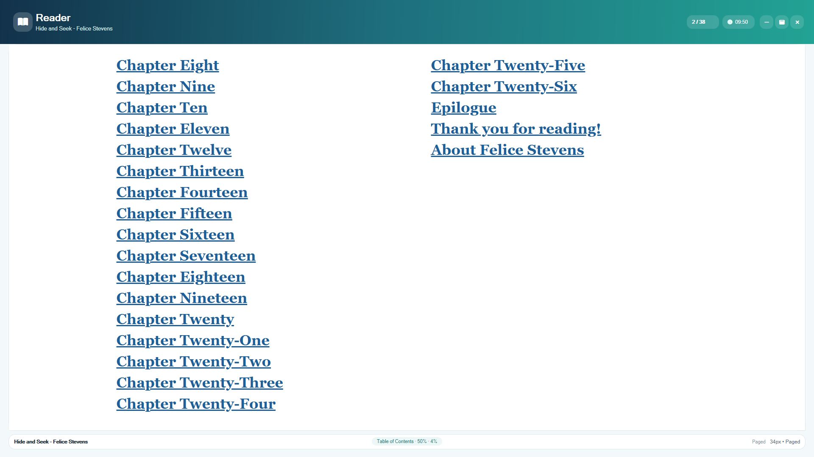
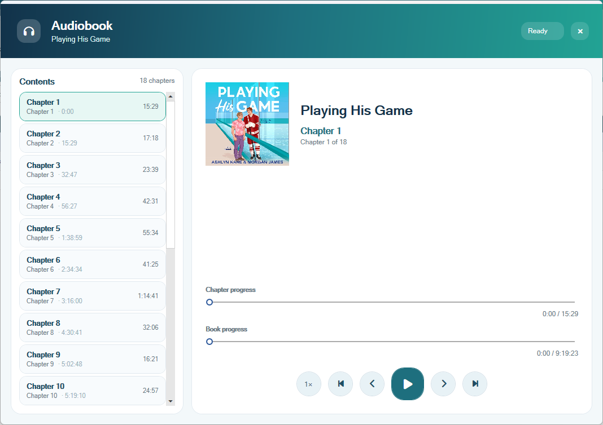
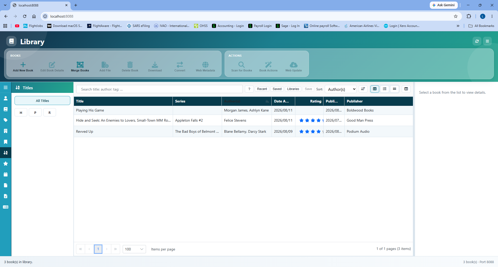

# BookAtrium

BookAtrium is a Windows ebook and audiobook library application for organising, reading, listening to, and managing a personal book collection.

This repository is the official public home for BookAtrium downloads, documentation, support, feature requests, software issue reporting, and community discussions.

> The BookAtrium core application source code is private and is not stored in this public repository.

## Download BookAtrium

BookAtrium **v1.0.2** is available from the official GitHub Releases page.

[Download BookAtrium releases](../../releases)

Only download BookAtrium from this repository or another location explicitly identified as an official BookAtrium download source. GitHub Releases here contain **application** installers only.

## Project Status

BookAtrium **v1.0.2** is a public **beta**. Core library, reading, listening, backup, help, and plugin features are available for everyday use, while behaviour, packaging, and documentation continue to improve with feedback.

Public installers, release notes, and update information for the application are published through this repository.

## Screenshots

See BookAtrium in action across its desktop library, reading, listening, metadata, and web-library experiences. Select any screenshot to view it at full size.

<table>
  <tr>
    <td width="50%" align="center">
      <a href="docs/images/screenshots/main-library-table-view.png"></a>
      <br><strong>Main library — table view</strong>
    </td>
    <td width="50%" align="center">
      <a href="docs/images/screenshots/main-library-list-view.png"></a>
      <br><strong>Main library — list view</strong>
    </td>
  </tr>
  <tr>
    <td width="50%" align="center">
      <a href="docs/images/screenshots/book-details-editor.png"></a>
      <br><strong>Book details and metadata editor</strong>
    </td>
    <td width="50%" align="center">
      <a href="docs/images/screenshots/ebook-reader.png"></a>
      <br><strong>Built-in ebook reader</strong>
    </td>
  </tr>
  <tr>
    <td width="50%" align="center">
      <a href="docs/images/screenshots/audiobook-player.png"></a>
      <br><strong>Audiobook player with chapters</strong>
    </td>
    <td width="50%" align="center">
      <a href="docs/images/screenshots/web-library.png"></a>
      <br><strong>Web library</strong>
    </td>
  </tr>
</table>

## What BookAtrium Does

BookAtrium is designed around a local personal library on Windows. Major end-user capabilities include:

- Creating and opening local libraries
- Importing books (including Calibre library import and drag-and-drop)
- Browsing by authors, series, categories, table view, and cover thumbnails
- Searching, filtering, saved searches, and virtual libraries
- Editing metadata, covers, and book details (including bulk edit and merge)
- Reading ebooks (including EPUB and PDF workflows)
- Playing audiobooks with chapter-aware playback
- Recycle bin / undo for library care
- Backup and restore, library health checks, and search-index maintenance
- Built-in help
- Optional web / OPDS-style library access
- Official and community plugins for stores, metadata, formats, and related extensions

## Supported Platform

BookAtrium currently supports:

- Windows 10
- Windows 11
- 64-bit systems

Support for additional platforms may be considered in the future.

## Documentation

In-app help and documentation cover installation and first launch, library management, importing and organising books, covers and metadata, ebook and audiobook reading, search and virtual libraries, backup and restore, options, shortcuts, troubleshooting, and plugin development.

User-facing help is included with the application. Additional public documentation and plugin guides are maintained in this repository under [`docs/`](docs/).

### Plugin development (API 2.1)

Third-party plugins reference **only** the public NuGet package:

```xml
<PackageReference Include="BookAtrium.PluginContracts" Version="2.1.0" />
```

BookAtrium hosts **Plugin API 2.1**. New third-party plugin packages use the `.bookplugin` extension.

- Source and package metadata: [`BookAtrium.PluginContracts`](BookAtrium.PluginContracts/)
- Guides: [`docs/plugins/sdk-2`](docs/plugins/sdk-2/)
- Reusable CI: [`.github/workflows/plugin-build.yml`](.github/workflows/plugin-build.yml)
- Community catalogue (third-party metadata only): [BookAtrium-Community-Plugins](https://github.com/lgdeysel1980/BookAtrium-Community-Plugins)

The application core remains private. Third-party plugin projects should reference only `BookAtrium.PluginContracts`. Official BookAtrium plugins are developed privately and **bundled with the application**; they are not downloaded from this repository.

## Support

Choose the support option that best matches your request:

- [Report a software bug](../../issues/new?template=01-bug-report.yml)
- [Request a feature](../../issues/new?template=02-feature-request.yml)
- [Report an installation or update problem](../../issues/new?template=03-installation-update.yml)
- [Report a documentation problem](../../issues/new?template=04-documentation.yml)
- [Apply to assist with BookAtrium development](../../issues/new?template=05-developer-interest.yml)
- [Ask a general question](../../discussions)

Before creating a new issue, please search the existing issues to see whether the problem or request has already been reported.

When reporting a problem, include your BookAtrium version, Windows version, the affected area, clear reproduction steps, expected result, and any relevant error message or screenshot. Do not include passwords, licence keys, private ebooks, personal documents, database backups, customer information, or other confidential material.

Feature requests should explain the problem to solve, how BookAtrium would improve, and a concrete example of use. Early ideas are welcome in [GitHub Discussions](../../discussions).

## Official BookAtrium Plugins

Official first-party plugins are **bundled with BookAtrium**. They are not downloaded separately from GitHub, a plugin directory, or GitHub Releases.

An official plugin that integrates with a third-party website or service is not necessarily affiliated with or endorsed by that third party. Refer to in-app plugin documentation for applicable notices.

### Current official plugins

| Plugin | Version | Type | Plugin | Version | Type |
|--------|---------|------|--------|---------|------|
| Amazon | 1.0.6 | Metadata Source | Amazon US Kindle Store | 1.0.5 | Store |
| AZW3 Conversion Output | 1.0.0 | Conversion Output | Core Book File Types | 1.0.0 | File Type |
| Core Input Profiles | 1.0.0 | Input Profile | Core Output Profiles | 1.0.0 | Output Profile |
| Demo Store | 1.0.0 | Store | DOCX Conversion Input | 1.0.0 | Conversion Input |
| DOCX Conversion Output | 1.0.0 | Conversion Output | DOCX Metadata Reader | 1.0.0 | Metadata Reader |
| DOCX Metadata Writer | 1.0.0 | Metadata Writer | EPUB Conversion Input | 1.0.0 | Conversion Input |
| EPUB Conversion Output | 1.0.0 | Conversion Output | EPUB Metadata Writer | 1.0.0 | Metadata Writer |
| ePub/KePub Metadata Reader | 1.0.0 | Metadata Reader | ExifTool Metadata Reader | 1.0.0 | Metadata Reader |
| FB2 Conversion Input | 1.0.0 | Conversion Input | FB2 Metadata Reader | 1.0.0 | Metadata Reader |
| FB2 Metadata Writer | 1.0.0 | Metadata Writer | Goodreads | 1.0.0 | Metadata Source |
| Goodreads | 1.0.0 | Author Metadata Source | Google | 1.0.0 | Metadata Source |
| Google Images | 1.0.0 | Metadata Source | HTML Conversion Input | 1.0.0 | Conversion Input |
| HTML Conversion Output | 1.0.0 | Conversion Output | HTML Metadata Reader | 1.0.0 | Metadata Reader |
| KEPUB Conversion Input | 1.0.0 | Conversion Input | KEPUB Conversion Output | 1.0.0 | Conversion Output |
| Kindle Conversion Input | 1.0.0 | Conversion Input | LIT Metadata Reader | 1.0.0 | Metadata Reader |
| LRF Conversion Output | 1.0.0 | Conversion Output | LRF Metadata Reader | 1.0.0 | Metadata Reader |
| LRF Metadata Writer | 1.0.0 | Metadata Writer | LRX Metadata Reader | 1.0.0 | Metadata Reader |
| M4B/M4A Audiobook Metadata Reader | 1.0.0 | Metadata Reader | MOBI Conversion Output | 1.0.0 | Conversion Output |
| MOBI Metadata Reader | 1.0.0 | Metadata Reader | MP3 Audiobook Metadata Reader | 1.0.0 | Metadata Reader |
| ODT Metadata Reader | 1.0.0 | Metadata Reader | ODT Metadata Writer | 1.0.0 | Metadata Writer |
| OEB Conversion Output | 1.0.0 | Conversion Output | Open Library | 1.0.0 | Metadata Source |
| OPF Metadata Reader | 1.0.0 | Metadata Reader | PDF Conversion Input | 1.0.0 | Conversion Input |
| PDF Conversion Output | 1.0.1 | Conversion Output | PDF Metadata Reader | 1.0.0 | Metadata Reader |
| PDF Metadata Writer | 1.0.0 | Metadata Writer | RAR Metadata Reader | 1.0.0 | Metadata Reader |
| RTF Metadata Reader | 1.0.0 | Metadata Reader | RTF Metadata Writer | 1.0.0 | Metadata Writer |
| Topaz Metadata Reader | 1.0.0 | Metadata Reader | TXT Conversion Input | 1.0.0 | Conversion Input |
| TXT Conversion Output | 1.0.0 | Conversion Output | ZIP Metadata Reader | 1.0.0 | Metadata Reader |

Amazon US Kindle Store is an official first-party BookAtrium plugin for searching Amazon US Kindle listings. It is not affiliated with, sponsored by, approved by, or endorsed by Amazon. Amazon and Kindle are trademarks of Amazon.com, Inc. or its affiliates.

## Third-Party Plugins

This section applies only to independently published third-party (community) plugins.

BookAtrium supports community plugins through **Plugin API 2.1**. Developers may distribute plugins free of charge or commercially.

Third-party plugins are distributed by their respective developers. BookAtrium does not operate an official third-party marketplace and does not host, sell, approve, certify, endorse, or support independently developed plugins unless expressly stated otherwise.

Community catalogue metadata (not packages) may appear in [BookAtrium-Community-Plugins](https://github.com/lgdeysel1980/BookAtrium-Community-Plugins). Official BookAtrium plugins are not submitted there.

Third-party plugin developers are responsible for hosting, pricing, licensing, support, updates, compatibility, security, privacy, legal compliance, and any data their plugins collect or process.

Install plugins only from developers and sources you trust. Third-party plugins follow the plugin developer’s own terms, licence, privacy policy, and support arrangements.

Normal plugin development does not require access to BookAtrium’s private core source code.

## Core Application Development

The BookAtrium core application is privately developed and proprietary.

Developers interested in helping with core development may [apply](../../issues/new?template=05-developer-interest.yml) to become approved volunteer contributors. Access is selective and may require NDA, contribution, and security agreements. Participation is voluntary and unpaid, and does not create an employment or payment relationship.

BookAtrium is currently intended to be available without charge. Optional premium functionality, paid services, commercial editions, or another commercial model may be introduced in the future.

## Releases and Updates

Application releases are published through GitHub Releases and may include a signed installer, release notes, user documentation, and checksums where applicable.

This repository’s GitHub Releases contain **application** releases only. Official plugins ship with BookAtrium and are not published as separate release assets.

BookAtrium may use release information published in this repository to check for application updates.

## Security

Do not report security vulnerabilities through public GitHub Issues or Discussions.

Please read the [Security Policy](SECURITY.md) for the current security-reporting process.

## Privacy

Public issues and discussions can be viewed by anyone. Never submit passwords, licence keys, personal identification information, private ebook files, customer or business information, database backups, private source code, confidential project material, unedited diagnostic files containing sensitive data, or signing certificates / API credentials.

Always review screenshots, logs, and diagnostic information before uploading them publicly.

[Read the BookAtrium Privacy Policy](PRIVACY.md)

## Contributing

Please read [CONTRIBUTING.md](CONTRIBUTING.md) before submitting issues, participating in Discussions, developing plugins, or applying to help with core development.

## Licence

The BookAtrium core application is private and proprietary.

Plugin contracts, samples, and documentation may use separate licences where indicated.

The absence of an open-source licence for the core application does not grant permission to copy, modify, redistribute, or commercially use the private BookAtrium source code.

## Software Licence

BookAtrium is proprietary software distributed under the
[BookAtrium End-User Licence Agreement](EULA.md).

The Software may currently be used without charge, but it is not open-source software.

## BookAtrium Community

- [Issues](../../issues)
- [Discussions](../../discussions)
- [Releases](../../releases)
- [Contribution Guidelines](CONTRIBUTING.md)
- [Security Policy](SECURITY.md)
- [Code of Conduct](CODE_OF_CONDUCT.md)
